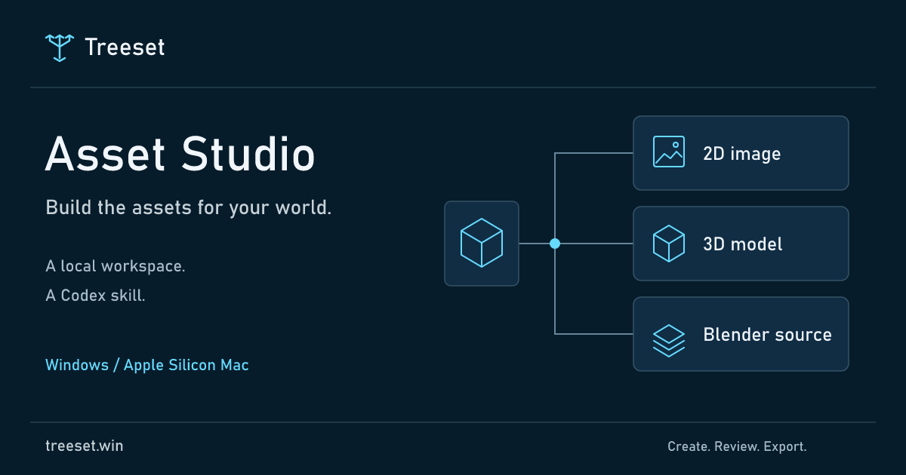
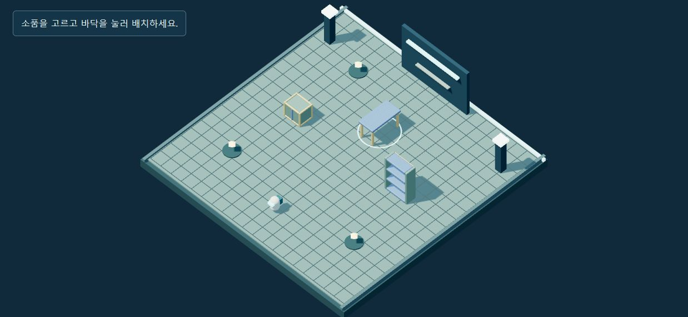
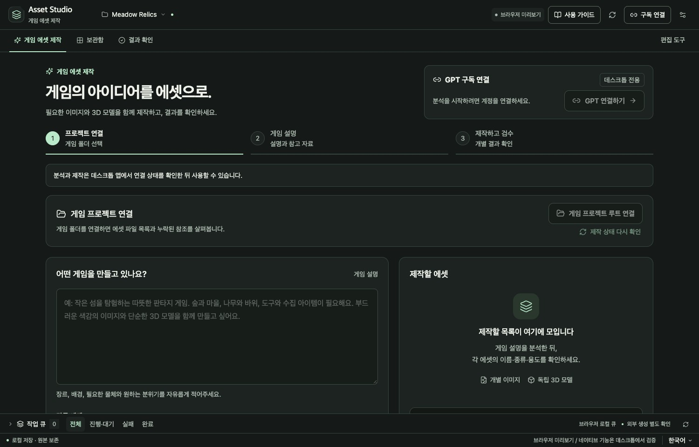
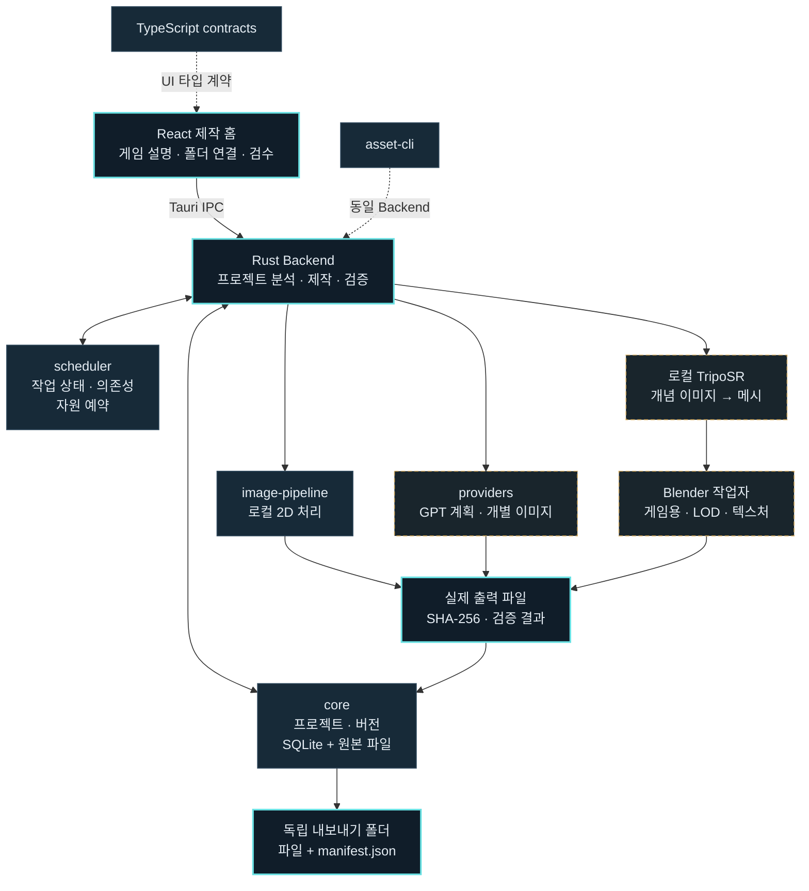

<p align="center">
  
</p>

<h1 align="center">Asset Studio</h1>

<p align="center">
  <strong>게임을 설명하고, 필요한 이미지와 3D 에셋을 한 번에.</strong><br>
  프로젝트를 연결해 제작 목록을 만들고, 개별 결과를 확인하세요.
</p>

<p align="center">
  <a href="https://github.com/oocheol/masset/releases/tag/v0.1.13"></a>
  <a href="https://github.com/oocheol/masset/releases/download/v0.1.13/AssetStudio_0.1.13_x64-setup.exe"></a>
  <a href="https://github.com/oocheol/masset/releases/download/v0.1.13/AssetStudio_0.1.13_macos-arm64.dmg"></a>
  <a href="LICENSE"></a>
</p>

<p align="center">
  <a href="https://treeset.win/"><strong>Treeset · 기능 소개 사이트</strong></a> ·
  <a href="https://treeset.win/play/workshop/"><strong>설치 없는 웹 예제</strong></a> ·
  <a href="https://github.com/oocheol/masset/releases/tag/v0.1.13"><strong>다운로드</strong></a> ·
  <a href="#project-structure">프로젝트 구조</a> ·
  <a href="docs/windows-quickstart.md">사용 가이드</a>
</p>

Treeset이 만드는 오픈소스 게임 에셋 제작 도구입니다. 공식 사이트는 [treeset.win](https://treeset.win/), 문의는 [oocheol@treeset.win](mailto:oocheol@treeset.win)입니다.

Maintained by **JEONG WOOCHEOL**, a Java developer in his fifth year: [GitHub profile](https://github.com/oocheol). Treeset is an independent project that has not yet been incorporated. Inspect the [English project overview and real local workflow](https://treeset.win/about/#local-workflow).

[](https://treeset.win/play/workshop/)

**설치 없이 직접 체험:** [한국어 웹 예제](https://treeset.win/play/workshop/) · [English demo](https://treeset.win/play/workshop/en/) · [제작 과정](https://treeset.win/devlog/workshop/) · [GLB·Blender·장면 JSON 묶음](https://treeset.win/examples/workshop-starter.zip). 실제 Windows 로컬 제작 소품 3개로 만든 작은 작업장입니다. 로봇 이동·셀 전달, 소품 배치·회전, 장면 JSON과 PNG 저장을 제공합니다. 개발자 예시이며 외부 사용자 사례나 Claude 생성 결과가 아닙니다. [예제 구조와 검증 범위](docs/web-workshop-example.md)

**Claude asset planning is a source prototype, with live verification pending.** The desktop panel and native CLI adapter accept an explicit brief and return reviewable per-asset instructions. The maintainer has no Pro/Max subscription, so no actual Claude request or generated plan is claimed. Published 0.1.13 downloads do not include this prototype. See the [implementation specification](docs/claude-asset-planning.md) and [public verification record](https://treeset.win/workflows/claude-asset-brief/).

Tauri 2 + Rust + React/TypeScript로 만든 오픈소스 게임 에셋 제작 도구입니다. **게임 설명 + 프로젝트 루트 연결 → 필요한 에셋 분석 → 개별 제작 → 결과 검수**를 기본 화면으로 제공합니다. Windows 0.1.13과 Apple Silicon Mac 0.1.13에서 GPT 참고 이미지를 로컬 TripoSR와 Blender로 3D로 제작할 수 있습니다. 기존 GLB 다듬기와 기본 소품 제작은 **편집 도구**로 이용하세요.

**Windows·Mac 앱과 독립 CLI는 모두 0.1.13입니다. GitHub 공용 설치 기능은 0.1.14이며 양쪽 CLI 0.1.13을 준비합니다. npm 레지스트리 게시는 인증 준비 중입니다.** 검증된 원시 3D 캐시, 단계별 자원 배분, 형태를 보존하는 LOD와 UV 개선을 Mac에도 반영했습니다. 완성된 모델은 선택 미리보기보다 먼저 저장하며, 미리보기 오류가 모델 제작을 실패로 바꾸지 않습니다. 두 플랫폼의 앱 없는 Codex 스킬은 기존 공식 로그인을 재사용하고, 필요한 도구는 동의 후 사용자 전용 공간에 준비합니다. Apple Silicon Mac 앱·DMG·서명된 업데이트·독립 CLI를 추가 빌드했습니다. [게임 제작 흐름](docs/game-production.md) · [Windows 0.1.13 검증](docs/releases/v0.1.13-windows.md) · [Mac 0.1.13 검증 범위](docs/releases/v0.1.13-macos.md)

Windows 실제 CLI의 한 이미지→3D 예제에서 첫 제작은 **80.9초**, 같은 원시 모델을 검증해 재사용한 제작은 **31.2초**였습니다. 원시 GLB는 바이트가 같고 재사용 시 재추론하지 않았습니다. 같은 원시 구형 메시의 512px UV 표면 사용률은 이전 결과 **5.74% → 25.05%**로 늘었습니다. 단일 CPU 예제의 관측값이며 모든 입력의 속도나 보이지 않는 형상의 정확도를 보장하지 않습니다. [측정 범위와 재열기 검사](docs/releases/v0.1.13-windows.md)를 확인하세요.

**3D 만들기**에서 투명 배경의 단일 물체 이미지 또는 GLB를 최대 5개 선택하세요. 이미지마다 모델 하나를 만들고, 기존 GLB는 원본을 남긴 새 버전으로 저장합니다. 게임용·고해상도 형상·LOD, UV 색상 텍스처, 지원되는 경우 메시에서 베이크한 노멀맵, 편집 가능한 `.blend`, 썸네일·턴테이블을 함께 내보냅니다. 이미지 복원은 Windows x64 또는 Apple Silicon, 최소 16GB 메모리와 Blender가 필요합니다. Windows는 CPython 3.12.10을 앱 전용 공간에 준비하므로 시스템 Python이나 CUDA가 필요하지 않습니다. 최초 동의 후 Python·CPU 라이브러리·모델을 약 1.89GiB 내려받으며 Microsoft Visual C++ x64 런타임이 필요합니다. Mac은 CPython 3.9를 사용합니다. 준비 후 CPU에서 로컬로 실행하고 유료 API로 대체하지 않습니다. 구형 TripoSR을 사용하며 최신 Tripo Studio와 같은 품질이나 8K·리깅·쿼드 리토폴로지는 제공하지 않습니다. [사용 방법과 결과 범위](docs/model-quality.md)를 확인하세요.

Mac 0.1.6의 **게임 에셋 묶음**은 게임 설명으로 GPT-5.5 (`gpt-5.5`)의 텍스트 구성안을 요청합니다. 2D 이미지·3D 모델·혼합 구성을 고르고, 이름과 설명이 있는 행을 수정·승인해 포함한 항목을 한 번에 큐에 제출하세요. [게임 에셋 묶음 사용 흐름](docs/game-asset-bundles.md)에서 참고 자료 전송 동의, 개별 이미지 수와 고정 3D 레시피를 안내합니다. Mac 네이티브 백엔드에서 실제 구성안을 받아 무기 이미지 5장과 모델 2개를 개별 에셋으로 제작·저장·재열기·내보내기했습니다.

## 제작 화면 미리보기

[](apps/site/public/media/production-home-browser-011.jpg)

프로젝트 연결 → 게임 설명 → 개별 제작 → 결과 검수를 중심으로 구성했습니다. 현재 단계, 연결 상태와 제작 목록을 함께 확인하고, 보관함과 결과 화면을 오가도 제작 입력 상태를 유지합니다. 위 이미지는 **Windows·Mac 0.1.13 디자인의 브라우저 미리보기**입니다. Windows의 실제 네이티브 실행 검증은 별도 배포 기록에 구분합니다. 이미지를 누르면 원본 크기로 볼 수 있습니다. [레퍼런스·디자인 검증 기록](docs/design/2026-10-06-refresh.md)

<details>
<summary><strong>이전 편집 화면 보기 · 0.1.3</strong></summary>

[](apps/site/public/media/workstation-browser-013.png)

라이브러리, 2D 캔버스, 3D 뷰포트와 버전 비교를 이용한 기존 편집 화면입니다. 이 화면도 브라우저 캡처이며 네이티브 실행 검증과 구분합니다.

</details>

<details>
<summary><strong>앱 안의 사용 가이드 보기</strong></summary>

[](docs/media/readme/workbench-guide-013.png)

주요 버튼·입력 글씨는 14px 이상, 가이드는 16px입니다. 단계별 안내, 접을 수 있는 설명, Esc 닫기와 키보드 포커스를 지원합니다. 이 화면도 브라우저 UI 검사에서 캡처했습니다.

</details>

## 실제 제작 결과

| 상자 · Crate | 테이블 · Table | 선반 · Shelf |
| :---: | :---: | :---: |
| [](examples/procedural/run-8fa3777b7c994505ba1c5592453a8543/crate/model.glb) | [](examples/procedural/run-8fa3777b7c994505ba1c5592453a8543/table/model.glb) | [](examples/procedural/run-8fa3777b7c994505ba1c5592453a8543/shelf/model.glb) |
| 1.2 × 0.9 × 0.8 m | 1.6 × 0.76 × 0.8 m | 1.0 × 1.8 × 0.4 m |
| [GLB](examples/procedural/run-8fa3777b7c994505ba1c5592453a8543/crate/model.glb) · [Blender 원본](examples/procedural/run-8fa3777b7c994505ba1c5592453a8543/crate/source.blend) | [GLB](examples/procedural/run-8fa3777b7c994505ba1c5592453a8543/table/model.glb) · [Blender 원본](examples/procedural/run-8fa3777b7c994505ba1c5592453a8543/table/source.blend) | [GLB](examples/procedural/run-8fa3777b7c994505ba1c5592453a8543/shelf/model.glb) · [Blender 원본](examples/procedural/run-8fa3777b7c994505ba1c5592453a8543/shelf/source.blend) |

세 이미지는 저장소의 **고정 Blender 작업자가 실제 메시에서 렌더한 512px 썸네일**입니다. GLB, 편집 가능한 `.blend`, 턴테이블 PNG와 [파일별 검증 기록](examples/procedural/run-8fa3777b7c994505ba1c5592453a8543/verification.json)이 함께 있습니다. 치수는 GLB의 X × Y × Z이며 미터/Y-up 기준입니다. 작업자 직접 실행 결과로, AI 이미지 생성이나 앱 전체 흐름의 성공 증거로 표시하지 않습니다.

[로컬 아이콘 12종과 모델 예제 더 보기 →](examples/README.md)

## 무엇을 할 수 있나요?

| 기능 | 작업대에서 하는 일 | 남는 결과 |
| --- | --- | --- |
| 이미지 편집 | PNG/WebP/JPEG 가져오기, 크기·색상·배경·마스크 처리 | 원본과 구분된 새 이미지 버전 |
| 스프라이트·아틀라스 | 프레임을 나누고 여러 이미지를 묶어 패킹 | 실제 이미지와 프레임 메타데이터 |
| 게임 에셋 묶음 · Mac 0.1.6 | 게임 설명 → 텍스트 구성안 → 개별 행 편집·승인 → 포함한 행을 한 번에 큐 등록 | 개별 이미지·새 독립 모델 또는 기존 2D의 새 버전 |
| 게임 프로젝트 제작 · Windows 0.1.13 · Mac 0.1.13 | 게임 설명·루트 폴더 분석 → 개별 제작 → 결과 확인·검수 | 새 게임 결과 폴더, 개별 PNG·GLB·해시 명세, 최대 120개 |
| 절차적 3D · Mac 0.1.6 | 상자·테이블·선반·검·소총·우주선·배럴·바위·나무의 치수·베벨·색상 지정 | 개별 GLB, 편집 가능한 `.blend`, 렌더 |
| 이미지→3D · 모델 다듬기 · Windows·Mac | 투명 이미지의 개별 메시 복원 또는 기존 GLB의 예산·UV·재질 정리 | 원본 보존, 게임용·고해상도·LOD GLB, 텍스처·`.blend`·턴테이블 |
| 로컬 TRELLIS.2 · 개발 소스 실험 기능 | Windows WSL2 · NVIDIA VRAM 24GiB · 시스템 RAM 32GiB · 별도 준비한 런타임 | 외부 이미지 전송 없이 PBR 복원, 고정 모델·원본·결과 해시 기록 |
| 버전·캐시 | 이전 결과 비교, 검증된 결과의 명시적 재사용 | 해시와 제작 이력이 있는 에셋 |
| 작업 큐 | 의존 관계, 자원 한도, 취소·복구·부분 재실행 | SQLite에 저장되는 작업 상태 |
| 독립 내보내기 | 선택한 에셋과 버전을 새 묶음으로 저장 | 실제 파일 + 상대 경로·SHA-256이 있는 `manifest.json` |
| 구독 이미지 연결 | Windows·Apple Silicon Mac에서 공식 Codex 준비·로그인·명시적 생성 요청 | 검증 후 저장한 파일과 요청·확인 모델 정보 |

기본 아이콘은 로컬 SVG/PNG 예제입니다. GPT-6.1 Sol(`gpt-6.1-sol`) 추론과 GPT Image 2(`gpt-image-2`) 목표의 구독 경로는 **Windows 0.1.2와 Mac 0.1.5 구현에서 각각 새 이미지 한 장의 수신·저장·재열기·독립 내보내기를 실증**했습니다. 실제 이미지 모델 ID는 응답에서 제공되지 않아 `confirmedModel=null`이며, 모든 계정의 모델 권한을 보장하지 않습니다.

[공급자 실증](docs/provider-feasibility.md) · [ima2-gen 구조 비교](docs/ima2-gen-comparison.md) · [현재 구현 범위](docs/completion-status.md)

Mac 0.1.6 묶음의 **요청 이미지 수**는 이미지·스프라이트·텍스처 행을 합친 정확한 수입니다. 혼합 구성의 모델 행은 별도로 셉니다. 2D 행마다 오브젝트 하나를 개별 PNG로 요청하며, 구성안을 수정한 뒤에는 포함한 행의 현재 수가 제출 수입니다. 참고 자료는 PNG·JPEG·WebP와 검증 가능한 GLB를 합쳐 최대 5개까지 선택하고 외부 전송에 명시적으로 동의합니다. GLB는 측정한 메시 메타데이터와 이미 있는 썸네일로 참고합니다. Mac 0.1.13의 모델 개선 도구도 원본을 보존한 새 버전으로 저장합니다.

**GPT-5.5는 도구 실행 없이 텍스트 구성안을 제안하는 플래너**, **GPT-6.1 Sol은 항목 승인 후 별도로 이미지 제작을 요청하는 이미지 에이전트**입니다. Windows 0.1.13과 Mac 0.1.13의 기본 제작은 GPT 참고 이미지에서 로컬 TripoSR와 Blender로 3D를 만듭니다. 공개 0.1.6 묶음의 모델은 Blender 고정 레시피를 사용합니다. 모델 설정이나 카탈로그 등록을 실제 플래너 응답의 성공으로 표시하지 않습니다.

## 다운로드와 시작하기

| 플랫폼 | 현재 다운로드 | 현재 범위 |
| --- | --- | --- |
| Windows x64 · 0.1.13 | [설치 파일](https://github.com/oocheol/masset/releases/download/v0.1.13/AssetStudio_0.1.13_x64-setup.exe) · [포터블 ZIP](https://github.com/oocheol/masset/releases/download/v0.1.13/AssetStudio-windows-x64-portable.zip) | 검증된 원시 3D 캐시 · UV·LOD 개선 · 별도 미리보기 · 앱 내부 업데이트 |
| 독립 Windows CLI · 0.1.13 | [스킬 ZIP](https://github.com/oocheol/masset/releases/download/v0.1.13/AssetStudio_0.1.13_codex-plugin-windows-macos-cli13.zip) · [CLI ZIP](https://github.com/oocheol/masset/releases/download/v0.1.13/AssetStudioCLI-0.1.13-windows-x64.zip) | 앱 없이 Codex에서 사용 · 기존 로그인 재사용 · 필요한 도구 자동 준비 |
| 독립 Mac CLI · 0.1.13 | [공통 스킬 ZIP](https://github.com/oocheol/masset/releases/download/v0.1.13/AssetStudio_0.1.13_codex-plugin-windows-macos-cli13.zip) · [CLI ZIP](https://github.com/oocheol/masset/releases/download/v0.1.13/AssetStudioCLI-0.1.13-macos-arm64.zip) | 앱 없이 Codex에서 사용 · CLI와 작업자 자동 준비 |
| Mac Apple Silicon · 0.1.13 | [DMG](https://github.com/oocheol/masset/releases/download/v0.1.13/AssetStudio_0.1.13_macos-arm64.dmg) | 프로젝트 기반 개별 2D·3D 제작 · Codex 스킬·CLI · GPT 구독 연결 · 앱 내부 업데이트 |

**Windows:** 설치 파일을 실행하거나 포터블 ZIP 전체를 새 폴더에 풀어 사용합니다. 기존 설치 사용자는 앱의 업데이트 패널에서 0.1.13을 확인하세요. WebView2와 3D용 Blender는 별도 필요하며, Node.js·Rust 개발 도구는 필요하지 않습니다. Codex가 없으면 **구독 연결 → Codex 준비 → 공식 계정 연결 → 연결 확인** 순서로 시작합니다. 이미지→3D는 **로컬 3D 준비**에서 다운로드 정보를 확인하고 동의하면 사용할 수 있습니다. 제작 화면에서 이미지·3D·혼합을 선택할 수 있고, Python·모델은 앱 전용 공간에 준비합니다. Codex 스킬만 사용하려면 아래 독립 설치 안내를 따르세요.

### Mac 설치

Apple 개발자 계정 없이 설치하려면 다음 명령을 **터미널에 붙여 넣고 안내를 확인한 뒤 `y`**를 입력합니다. 설치 스크립트 자체의 SHA-256을 먼저 확인하며, 스크립트는 공식 DMG의 크기·SHA-256과 앱 번들까지 검증합니다.

```sh
(
  set -eu
  install_tmp="$(mktemp -d)"
  trap 'rm -rf "$install_tmp"' EXIT
  curl -fsSL https://github.com/oocheol/masset/releases/download/v0.1.13/install-macos.sh -o "$install_tmp/install-macos.sh"
  printf '%s  %s\n' 'bb71a4c54d8db7ccf457ebb530af158d267336be8b4d0657820f02f0583c3149' "$install_tmp/install-macos.sh" | shasum -a 256 -c -
  bash "$install_tmp/install-macos.sh"
)
```

새 앱은 `~/Applications/Asset Studio 0.1.13/Asset Studio.app`에 설치합니다. 기존 앱을 닫고 새 앱을 사용하세요. 기존 앱·프로젝트·원본은 보존합니다. **Mac 0.1.3 이하는 업데이트 기능이 없으므로 공개 최신 앱을 한 번 직접 설치해야 합니다.** 이후에는 앱이 새 버전을 확인하고, 업데이트 패널에서 승인하면 서명·버전·크기·해시 검사 → 이전 앱 백업 → 교체 → 재실행 순서로 진행합니다. 제작 작업이 끝난 뒤 설치하며 프로젝트와 에셋 버전은 유지합니다.

브라우저로 DMG를 받았다면 앱을 홈 폴더의 Applications 안에 새 폴더를 만들어 복사하세요. 최초 실행 경고는 **시스템 설정 → 개인정보 보호 및 보안 → 확인 없이 열기 → 열기**로 허용할 수 있습니다. DMG 안에서 직접 실행하지 마세요. 업데이트가 설치 폴더에 쓰기 권한을 필요로 합니다.

**Mac 구독 연결:** 0.1.13에서 **구독 연결 → Codex 준비 → 공식 계정 연결 → 연결 확인** 순서로 진행합니다. OpenAI 서명이 유효한 공식 ChatGPT/Codex Mac 앱의 런타임을 재사용하고, 없으면 동의 후 검증된 Apple Silicon용 Codex 0.160.0을 앱 전용 공간에 준비합니다. 인증 정보는 공식 Codex가 관리하며 유료 API로 대체하지 않습니다. 0.1.4 이상은 앱 내부 업데이트로 0.1.13을 받을 수 있습니다.

Asset Studio의 Apple Developer ID 서명·공증은 없습니다. 앱 업데이트 파일은 프로젝트의 별도 키로 서명하며 Apple 공증과 구분합니다. 구독 연결에 쓰는 Codex 실행 파일·이미지 호스트의 OpenAI Developer ID 서명은 별도로 확인합니다. Mac Blender 작업자는 실제 생성·GLB·`.blend` 재열기를 검증했습니다. 기존 Mac 0.1.6 네이티브 백엔드에서 개별 PNG 5장·모델 2개의 제작·저장·재열기·내보내기를 확인했습니다.

[Windows 사용 가이드](docs/windows-quickstart.md) · [Mac 설치·업데이트 안내](docs/macos-quickstart.md) · [Mac 0.1.13 배포 기록](docs/releases/v0.1.13-macos.md) · [Windows 0.1.13 검증 기록](docs/releases/v0.1.13-windows.md)

## 앱 없이 Codex로 에셋 제작하기 · 독립 스킬 0.1.13

npm 레지스트리의 `latest`는 아직 0.1.13(Mac CLI 0.1.11 고정)입니다. 아래 설치·업데이트 명령은 공개 GitHub의 검증된 설치 패키지 0.1.14를 직접 사용해 Mac CLI도 0.1.13으로 준비합니다. npm 게시 인증을 완료한 뒤에는 `@latest` 명령도 같은 버전을 제공합니다.

**Asset Studio 앱을 설치하거나 열지 않고 Codex에서 사용할 수 있습니다.** Windows x64와 Apple Silicon Mac에서 Codex 스킬로 시작합니다. Codex가 필요하며, 아래 npm 설치 명령에는 Node.js 22.20 이상을 사용하세요.

```sh
npx --yes https://github.com/oocheol/masset/releases/download/v0.1.13/oocheol-asset-studio-0.1.14.tgz install
```

설치 후 **새 Codex 작업**에서 요청하세요.

> $asset-studio 게임에 사용할 캐릭터 이미지와 3D 소품을 만들어줘

npm 전역 설치를 선택했다면 **`asset-studio-skill install`도 한 번 실행**해야 Codex 스킬이 등록됩니다.

```sh
npm install --global https://github.com/oocheol/masset/releases/download/v0.1.13/oocheol-asset-studio-0.1.14.tgz
asset-studio-skill install
```

기존 공식 Codex 로그인을 재사용합니다. 처리용 네이티브 CLI와 작업자는 첫 사용 시 다운로드 동의를 받아 사용자 전용 폴더에 준비합니다. 3D 작업을 요청할 때만 Blender·Python·TripoSR를 추가로 준비합니다. 출처·크기·고정 해시·라이선스를 확인하며, 계정 인증이 필요한 경우 공식 로그인으로 안내합니다. 스킬은 지침과 설치 진입점이며 실제 처리는 독립 CLI가 수행합니다.

최신 npm 버전에 포함된 스킬로 업데이트하려면 다음을 실행하세요.

```sh
npx --yes https://github.com/oocheol/masset/releases/download/v0.1.13/oocheol-asset-studio-0.1.14.tgz update
```

[전용 npm 패키지](https://www.npmjs.com/package/@oocheol/asset-studio)는 Windows·Mac 공용 패키지 하나입니다. 운영체제에 맞는 CLI를 선택하며 각 플랫폼의 런타임 버전은 독립적으로 관리합니다. 이전·수정된 스킬을 백업하고 고정 배포 파일의 SHA-256을 검사합니다. GitHub 설치 기능 0.1.14는 Windows·Mac CLI 0.1.13을 준비하며 npm 레지스트리 게시는 인증 준비 중입니다. 공개 npm 0.1.13은 이전 내용으로 보존합니다. Node.js를 사용하지 않으려면 [스킬 플러그인 ZIP](https://github.com/oocheol/masset/releases/download/v0.1.13/AssetStudio_0.1.13_codex-plugin-windows-macos-cli13.zip)의 `skills/asset-studio`를 `~/.agents/skills/asset-studio`에 설치하세요. ZIP 설치에는 Node.js가 필요하지 않습니다.

[앱 없이 시작하는 설치 안내](docs/skill-first-setup.md) · [CLI·방식 비교](docs/codex-integration.md) · [이전 Mac 검증 범위](docs/codex-integration-validation.md) · [배포용 스킬 플러그인](integrations/codex/plugin.json)

## 게임 설명에서 제작과 검수까지 · Windows 0.1.13 · Mac 0.1.13

1. **GPT 구독 연결** — 공식 계정과 연결 상태를 확인합니다.
2. **게임 프로젝트 루트 연결** — 기존 게임 폴더를 선택하고 장르·시점·세계관·스타일을 설명합니다. 참고 이미지·모델도 선택할 수 있습니다.
3. **필요한 에셋 분석** — 파일 목록과 누락 참조를 바탕으로 필요한 개별 에셋 계획을 확인합니다.
4. **필요한 에셋 모두 제작** — 각 2D 이미지를 독립 요청합니다. Windows·Apple Silicon Mac의 3D 항목은 참고 이미지를 로컬 모델로 변환합니다. 새 게임 결과 폴더에 자동으로 저장합니다.
5. **결과 검수** — 카드에서 결과를 살펴보고 승인하거나 **이 에셋 개선하기**로 선택한 결과만 다시 제작합니다. 직접 편집은 별도 **편집 도구**에서 엽니다.

### 편집 도구와 내보내기

1. **가져오기** — 새 프로젝트에 원본 이미지를 넣고 규격·스타일을 정합니다.
2. **다듬기** — 이미지를 변환하거나 Blender 소품을 만들고 새 버전으로 저장합니다.
3. **확인하기** — 버전 비교·2D/3D 미리보기·작업 큐로 결과와 상태를 확인합니다.
4. **내보내기** — 실제 파일과 `manifest.json`이 담긴 새 폴더를 꺼냅니다. 내보낸 결과는 앱 DB 없이도 검사할 수 있습니다.

### 게임 설명에서 개별 에셋까지 · Mac 0.1.6

1. **게임 에셋 만들기** — **게임 에셋 묶음 구성안**에서 게임 설명과 **2D 이미지 / 3D 모델 / 이미지 + 3D 모델**을 선택합니다. 필요한 이미지 수를 입력하고 참고 이미지·GLB를 최대 5개 선택합니다.
2. **구성안 만들기** — 참고 자료 전송에 동의한 뒤 GPT 구독 연결에서 GPT-5.5의 텍스트 구성안을 요청합니다. 이 단계에서는 이미지·모델 파일을 제작하지 않습니다.
3. **개별 항목 검토** — 이름·설명·용도·참고 자료와 포함 여부를 수정합니다. 모델 행의 레시피·미터 치수·베벨·색상도 편집합니다. 기존 2D 개선은 지정한 원본 에셋의 새 버전으로 저장하며, 3D는 새 독립 모델로 제작합니다.
4. **검토한 에셋 묶음 제작** — 공통 규격·스타일과 항목을 승인해 포함한 행 전체를 한 번에 큐에 등록합니다. 각 작업의 실제 결과를 확인한 뒤 새 묶음으로 내보냅니다.

[게임 에셋 묶음의 수량·참고 자료·레시피 안내 →](docs/game-asset-bundles.md)

<a id="project-structure"></a>

## 프로젝트 구조

UI, 제작 도구, 저장소와 검증을 모듈로 나눴습니다. 네이티브 앱에서는 **Rust Backend가 작업자를 실행**하고, Scheduler가 영속 작업 상태·의존 관계·자원 예약을 관리합니다.



### 저장소 지도

```text
masset/
├─ apps/
│  ├─ desktop/
│  │  ├─ src/                 React 작업대·편집 UI·Three.js
│  │  ├─ public/examples/     로컬 SVG/PNG 아이콘 12종
│  │  └─ src-tauri/           Tauri 명령·Rust Backend·네이티브 CLI
│  └─ site/                   Vercel 소개·다운로드 사이트
├─ crates/
│  ├─ core/                   SQLite 프로젝트·버전·해시·내보내기
│  ├─ scheduler/              영속 큐·의존성·자원 예약·복구
│  ├─ image-pipeline/         이미지 변환·분할·아틀라스·검사
│  └─ providers/              공식 Codex RPC·Windows/Mac 런타임 준비
├─ packages/
│  ├─ contracts/              TypeScript 데이터·명령 계약
│  └─ ui/                     공용 색상 토큰
├─ workers/blender/           고정 Python 절차형 모델 작업자
├─ examples/procedural/       실제 GLB·blend·렌더·검증 기록
├─ scripts/                   빌드·패키징·라이선스·독립 파일 검사
├─ tests/                     저장소·이미지·공급자·Blender·E2E
├─ docs/                      설계·검증·플랫폼·릴리스 기록
├─ .github/workflows/         Windows CI·수동 ARM64 Mac 검증
├─ Cargo.toml / Cargo.lock    Rust workspace·의존성 잠금
└─ package.json / package-lock.json
                             npm workspace·의존성 잠금
```

CPU 이미지 처리, Blender와 외부 공급자는 별도의 자원 한도를 사용합니다. 입력 해시·도구 버전을 캐시 키에 넣고 저장 결과를 확인한 뒤 명시적으로 재사용합니다. 결과가 불명확한 외부 요청은 자동 재전송하지 않으며 유료 API로 조용히 전환하지 않습니다.

원본과 새 버전을 구분해 저장하고, 내보내기에는 상대 경로와 파일별 SHA-256을 기록합니다. Blender는 선택적 로컬 의존성으로 `--factory-startup --disable-autoexec`를 적용하며 에셋 입력을 코드로 실행하지 않습니다.

[아키텍처](docs/architecture.md) · [모듈 계약](docs/module-contract.md) · [보안 설계](docs/security-design.md) · [디자인 규칙](docs/design-system.md)

## 개발과 검증

개발 환경은 Node.js 24, Rust 1.99.0 stable입니다. Windows는 Visual Studio C++ 도구·Windows SDK·WebView2, Mac은 Xcode Command Line Tools가 필요합니다.

```powershell
npm ci
$env:Path = "$env:USERPROFILE\.cargo\bin;$env:Path"
. .\scripts\with-native-env.ps1
cargo test --workspace --locked
npm run typecheck
npm test
npm run desktop
```

<details>
<summary><strong>사이트·배포·독립 파일 검사 명령</strong></summary>

```powershell
# 소개 사이트
npm run site:dev
npm run site:build

# 새 폴더·ZIP으로 Windows 포터블 빌드
.\scripts\build-windows.ps1

# 앱 DB 없이 실제 내보낸 파일을 검사
npm run verify:artifacts -- 'C:\exports\내보낸 에셋'

# 네이티브 Backend 검사. 창·설치 검증과 구분
cargo build -p asset-desktop --bin asset-cli
.\scripts\native-smoke.ps1

# 실제 배포 EXE의 Blender GLB 로딩·WebGL 픽셀 검사
.\scripts\native-smoke.ps1 -Native3D -Executable 'C:\배포폴더\asset-desktop.exe'
```

NSIS 설치 파일은 승인·해시 검증한 캐시 도구와 저장소 밖의 서명 키를 사용합니다. Mac 패키지 검증은 수동 선택한 Apple Silicon CI에서 수행합니다. [플랫폼별 빌드 안내](docs/platform-support.md)를 참고하세요.

</details>

**Windows 0.1.8 검증:** 포터블 ZIP의 375개 파일과 설치 패키지 리소스 368개를 대조했습니다. 실제 WebView·이미지 12개·IPC·프로젝트 폴더 읽기·Blender GLB/WebGL, 네이티브 출력 33개 파일의 독립 검사, GLB 다듬기 후 980→1,620개 삼각형 복원과 이전 버전 보존을 확인했습니다. 별도 Blender 프로세스의 재열기 57개·53개 검사와 내보내기 26개 파일 검사, 공개 다운로드·공식 Tauri 업데이트 서명 검증을 통과했습니다. 이번 Windows 검사에서 새 GPT 요청, 기존 설치본 교체·재시작, 깨끗한 PC 실행은 수행하지 않았습니다. [이전 0.1.3 기록](docs/releases/v0.1.3.md)과 Mac의 별도 네이티브 기록을 함께 보존합니다.

[전체 검증 기록](docs/verification.md) · [Windows 배포 메타데이터](docs/releases/v0.1.8-windows.json) · [Mac 0.1.8 생성 검증](docs/releases/v0.1.8-macos.json) · [Mac 배포 상태](docs/releases/v0.1.8-distribution.json)

## 기여와 라이선스

[CONTRIBUTING](CONTRIBUTING.md) · [SECURITY](SECURITY.md) · [THIRD_PARTY_NOTICES](THIRD_PARTY_NOTICES.md)

코어 소스는 [Apache-2.0](LICENSE), Blender 작업자 코드는 별도 [GPL-3.0-or-later](workers/blender/LICENSE)입니다. Blender 실행 파일은 앱에 포함되지 않습니다. 예제 에셋의 권리와 외부 서비스 생성물·사용자 입력의 권리는 별도로 다룹니다. 외부 AI 서비스가 무료 또는 오픈소스라는 의미는 아닙니다.

이미지 기반 3D는 로컬 TripoSR을 사용하는 실험 기능이며 [품질과 지원 범위](docs/model-quality.md)를 따릅니다. 제조용 CAD와 임의 코드 플러그인 실행은 지원하지 않습니다.
