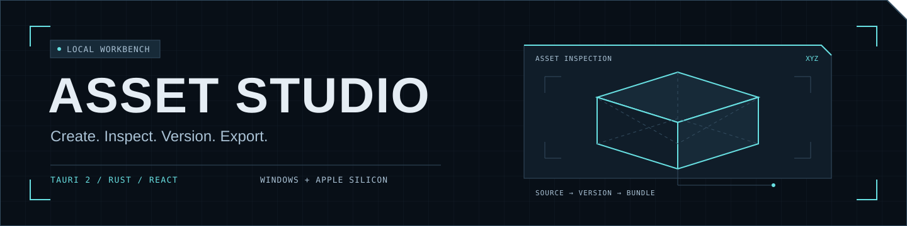
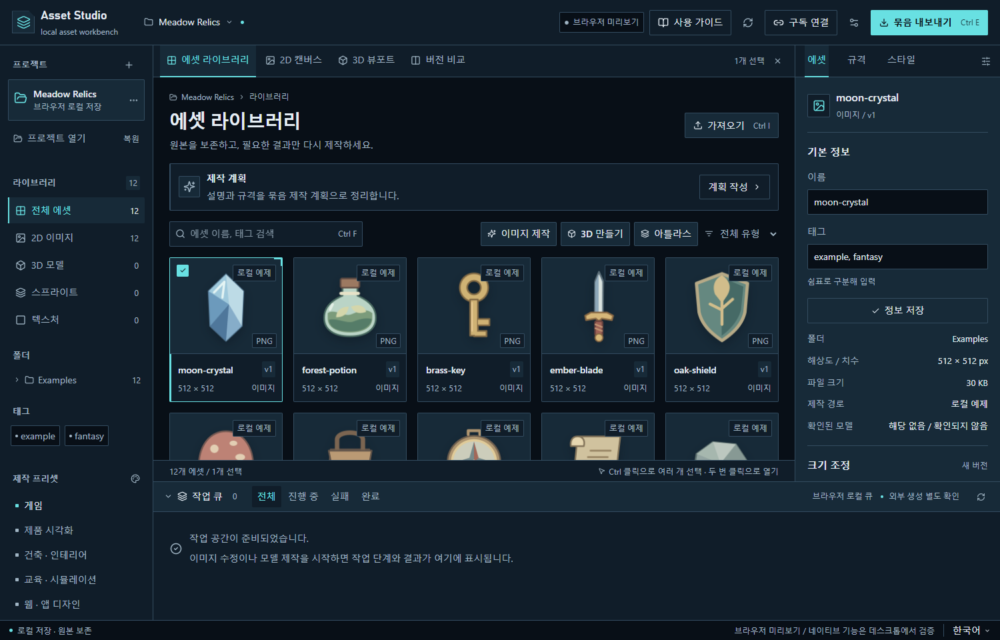
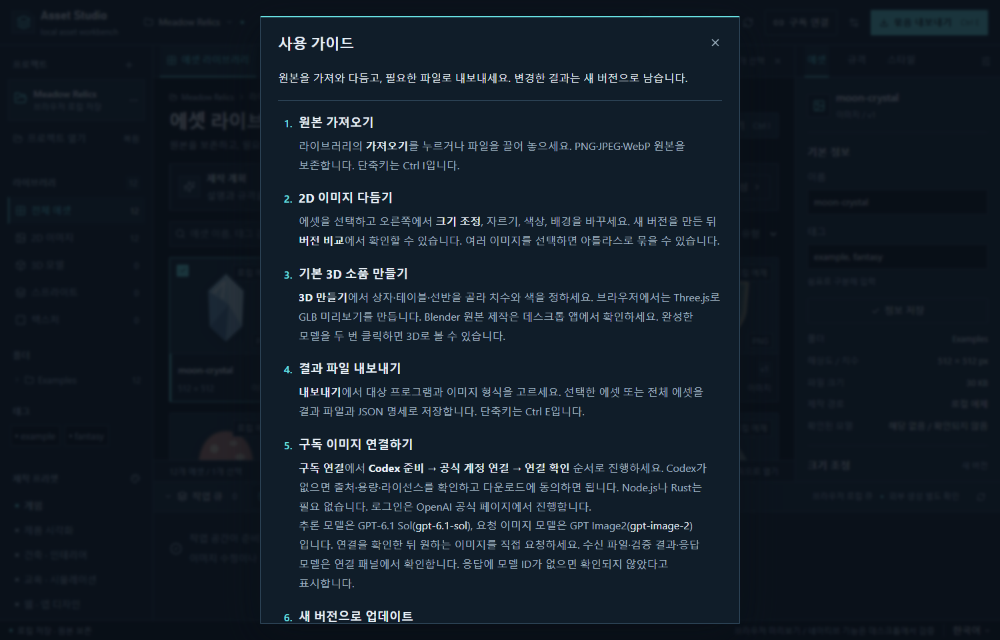
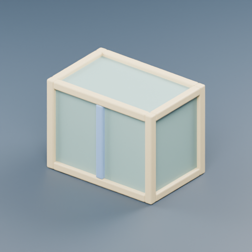
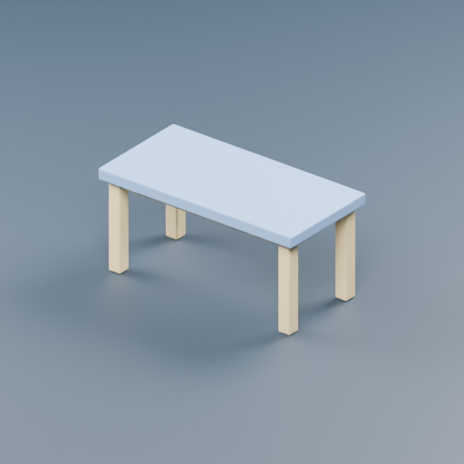
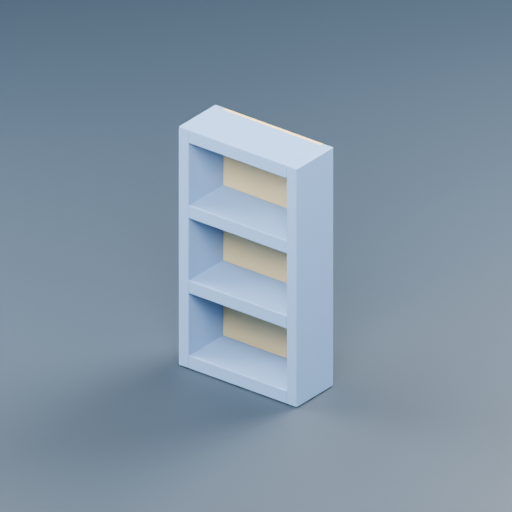
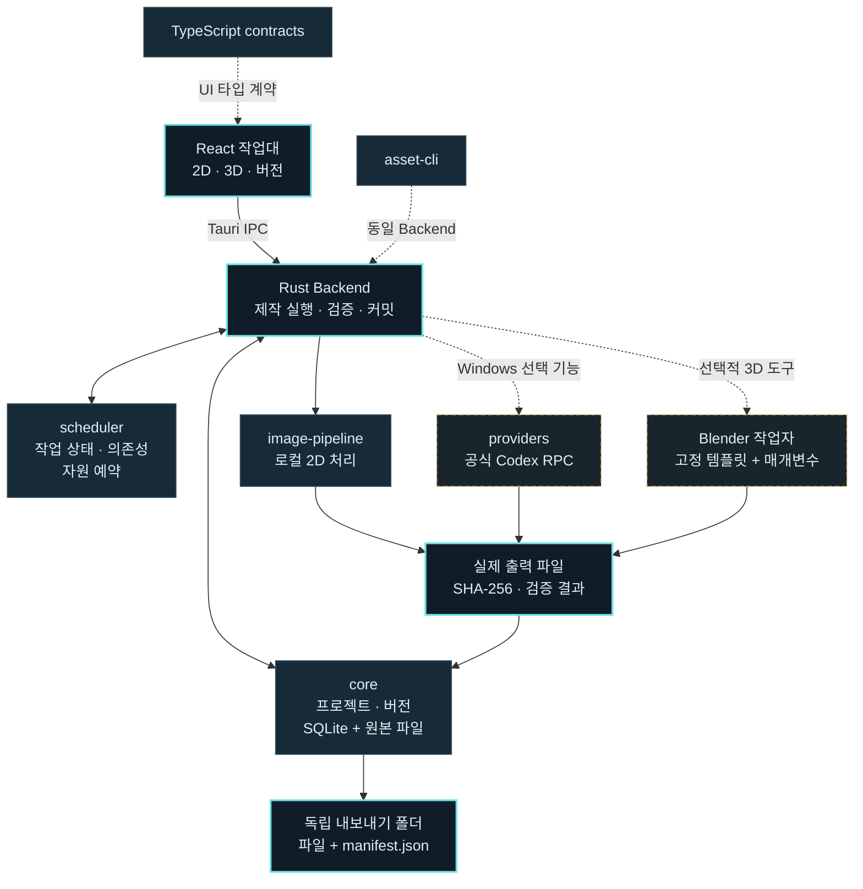

<p align="center">
  
</p>

<h1 align="center">Asset Studio</h1>

<p align="center">
  <strong>이미지와 3D 소품을 만들고 다듬는 로컬 작업실.</strong><br>
  원본을 남기고, 버전을 쌓고, 게임과 앱에 쓸 실제 파일을 꺼내세요.
</p>

<p align="center">
  <a href="https://github.com/oocheol/masset/releases/tag/v0.1.5"></a>
  <a href="https://github.com/oocheol/masset/releases/download/v0.1.3/AssetStudio_0.1.3_x64-setup.exe"></a>
  <a href="https://github.com/oocheol/masset/releases/download/v0.1.5/AssetStudio_0.1.5_macos-arm64.dmg"></a>
  <a href="LICENSE"></a>
</p>

<p align="center">
  <a href="https://masset-nu.vercel.app/"><strong>기능 소개 사이트</strong></a> ·
  <a href="https://github.com/oocheol/masset/releases/tag/v0.1.5"><strong>다운로드</strong></a> ·
  <a href="#project-structure">프로젝트 구조</a> ·
  <a href="docs/windows-quickstart.md">사용 가이드</a>
</p>

Tauri 2 + Rust + React/TypeScript로 만든 오픈소스 데스크톱 도구입니다. 이미지 편집, 스프라이트·아틀라스, 절차적 3D, 버전 관리와 독립 파일 내보내기를 한 작업대에서 다룹니다. **Mac 0.1.5는 GPT 구독 연결과 공식 Codex 준비를 지원하며, Apple 개발자 계정 없이 설치하고 앱 내부에서 업데이트할 수 있습니다.** Windows 공개 버전은 0.1.3을 유지합니다.

## 작업대 미리보기

[](apps/site/public/media/workstation-browser-013.png)

라이브러리 → 2D 캔버스 → 3D 뷰포트 → 버전 비교를 오가며, 오른쪽 검사 패널에서 에셋을 다듬고 아래 작업 큐에서 진행 상태를 확인합니다. 위 이미지는 **실제 0.1.3 브라우저 미리보기**이며 네이티브 실행 증거와 구분합니다. 이미지를 누르면 원본 크기로 볼 수 있습니다.

<details>
<summary><strong>앱 안의 사용 가이드 보기</strong></summary>

[](docs/media/readme/workbench-guide-013.png)

주요 버튼·입력 글씨는 14px 이상, 가이드는 16px입니다. 단계별 안내, 접을 수 있는 설명, Esc 닫기와 키보드 포커스를 지원합니다. 이 화면도 브라우저 UI 검사에서 캡처했습니다.

</details>

## 실제 제작 결과

| 상자 · Crate | 테이블 · Table | 선반 · Shelf |
| :---: | :---: | :---: |
| [](examples/procedural/run-8fa3777b7c994505ba1c5592453a8543/crate/model.glb) | [](examples/procedural/run-8fa3777b7c994505ba1c5592453a8543/table/model.glb) | [](examples/procedural/run-8fa3777b7c994505ba1c5592453a8543/shelf/model.glb) |
| 1.2 × 0.9 × 0.8 m | 1.6 × 0.76 × 0.8 m | 1.0 × 1.8 × 0.4 m |
| [GLB](examples/procedural/run-8fa3777b7c994505ba1c5592453a8543/crate/model.glb) · [Blender 원본](examples/procedural/run-8fa3777b7c994505ba1c5592453a8543/crate/source.blend) | [GLB](examples/procedural/run-8fa3777b7c994505ba1c5592453a8543/table/model.glb) · [Blender 원본](examples/procedural/run-8fa3777b7c994505ba1c5592453a8543/table/source.blend) | [GLB](examples/procedural/run-8fa3777b7c994505ba1c5592453a8543/shelf/model.glb) · [Blender 원본](examples/procedural/run-8fa3777b7c994505ba1c5592453a8543/shelf/source.blend) |

세 이미지는 저장소의 **고정 Blender 작업자가 실제 메시에서 렌더한 512px 썸네일**입니다. GLB, 편집 가능한 `.blend`, 턴테이블 PNG와 [파일별 검증 기록](examples/procedural/run-8fa3777b7c994505ba1c5592453a8543/verification.json)이 함께 있습니다. 치수는 GLB의 X × Y × Z이며 미터/Y-up 기준입니다. 작업자 직접 실행 결과로, AI 이미지 생성이나 앱 전체 흐름의 성공 증거로 표시하지 않습니다.

[로컬 아이콘 12종과 모델 예제 더 보기 →](examples/README.md)

## 무엇을 할 수 있나요?

| 기능 | 작업대에서 하는 일 | 남는 결과 |
| --- | --- | --- |
| 이미지 편집 | PNG/WebP/JPEG 가져오기, 크기·색상·배경·마스크 처리 | 원본과 구분된 새 이미지 버전 |
| 스프라이트·아틀라스 | 프레임을 나누고 여러 이미지를 묶어 패킹 | 실제 이미지와 프레임 메타데이터 |
| 절차적 3D | 상자·테이블·선반의 치수와 색상 지정 | GLB, 편집 가능한 `.blend`, 렌더 |
| 버전·캐시 | 이전 결과 비교, 검증된 결과의 명시적 재사용 | 해시와 제작 이력이 있는 에셋 |
| 작업 큐 | 의존 관계, 자원 한도, 취소·복구·부분 재실행 | SQLite에 저장되는 작업 상태 |
| 독립 내보내기 | 선택한 에셋과 버전을 새 묶음으로 저장 | 실제 파일 + 상대 경로·SHA-256이 있는 `manifest.json` |
| 구독 이미지 연결 | Windows·Apple Silicon Mac에서 공식 Codex 준비·로그인·명시적 생성 요청 | 검증 후 저장한 파일과 요청·확인 모델 정보 |

기본 아이콘은 로컬 SVG/PNG 예제입니다. GPT-6.1 Sol(`gpt-6.1-sol`) 추론과 GPT Image 2(`gpt-image-2`) 목표의 구독 경로는 **Windows 0.1.2와 Mac 0.1.5 구현에서 각각 새 이미지 한 장의 수신·저장·재열기·독립 내보내기를 실증**했습니다. 실제 이미지 모델 ID는 응답에서 제공되지 않아 `confirmedModel=null`이며, 모든 계정의 모델 권한을 보장하지 않습니다.

[공급자 실증](docs/provider-feasibility.md) · [ima2-gen 구조 비교](docs/ima2-gen-comparison.md) · [현재 구현 범위](docs/completion-status.md)

## 다운로드와 시작하기

| 플랫폼 | 현재 다운로드 | 현재 범위 |
| --- | --- | --- |
| Windows x64 · 0.1.3 | [설치 파일](https://github.com/oocheol/masset/releases/download/v0.1.3/AssetStudio_0.1.3_x64-setup.exe) · [포터블 ZIP](https://github.com/oocheol/masset/releases/download/v0.1.3/AssetStudio-windows-x64-portable.zip) | 로컬 2D·절차적 3D·구독 연결·앱 내부 업데이트 |
| Mac Apple Silicon · 0.1.5 | [DMG](https://github.com/oocheol/masset/releases/download/v0.1.5/AssetStudio_0.1.5_macos-arm64.dmg) | M 시리즈용 로컬 2D · GPT 구독 연결 · Codex 준비 · 앱 내부 업데이트. Intel 빌드는 제외 |

**Windows:** 설치 파일을 실행하거나 포터블 ZIP 전체를 새 폴더에 풀어 사용합니다. 기존 0.1.1/0.1.2 설치 사용자는 앱의 업데이트 패널에서 새 버전을 확인할 수 있습니다. WebView2와 3D용 Blender는 별도 필요하며, 이용자에게 Node.js·Rust 개발 도구는 필요하지 않습니다. Codex가 없으면 **구독 연결 → Codex 준비 → 공식 계정 연결 → 연결 확인** 순서로 시작합니다. 앱 전용 Codex 다운로드는 출처·라이선스·해시를 안내하고 동의 후 진행합니다.

### Mac 설치

Apple 개발자 계정 없이 설치하려면 다음 명령을 **터미널에 붙여 넣고 안내를 확인한 뒤 `y`**를 입력합니다. 설치 스크립트 자체의 SHA-256을 먼저 확인하며, 스크립트는 공식 DMG의 크기·SHA-256과 앱 번들까지 검증합니다.

```sh
(
  set -eu
  install_tmp="$(mktemp -d)"
  trap 'rm -rf "$install_tmp"' EXIT
  curl -fsSL https://github.com/oocheol/masset/releases/download/v0.1.5/install-macos.sh -o "$install_tmp/install-macos.sh"
  printf '%s  %s\n' 'fff494de08776b20cb0415e4e47cca32a43acfd1cf2ea664b67eae4e2fa71d01' "$install_tmp/install-macos.sh" | shasum -a 256 -c -
  bash "$install_tmp/install-macos.sh"
)
```

새 앱은 `~/Applications/Asset Studio 0.1.5/Asset Studio.app`에 설치합니다. 기존 앱을 닫고 새 앱을 사용하세요. 기존 앱·프로젝트·원본은 보존합니다. **Mac 0.1.3 이하는 업데이트 기능이 없으므로 0.1.5를 한 번 직접 설치해야 합니다.** 이후에는 앱이 새 버전을 확인하고, 업데이트 패널에서 승인하면 서명·버전·크기·해시 검사 → 이전 앱 백업 → 교체 → 재실행 순서로 진행합니다. 제작 작업이 끝난 뒤 설치하며 프로젝트와 에셋 버전은 유지합니다.

브라우저로 DMG를 받았다면 앱을 홈 폴더의 Applications 안에 새 폴더를 만들어 복사하세요. 최초 실행 경고는 **시스템 설정 → 개인정보 보호 및 보안 → 확인 없이 열기 → 열기**로 허용할 수 있습니다. DMG 안에서 직접 실행하지 마세요. 업데이트가 설치 폴더에 쓰기 권한을 필요로 합니다.

**Mac 구독 연결:** 0.1.5에서 **구독 연결 → Codex 준비 → 공식 계정 연결 → 연결 확인** 순서로 진행합니다. OpenAI 서명이 유효한 공식 ChatGPT/Codex Mac 앱의 런타임을 재사용하고, 없으면 동의 후 검증된 Apple Silicon용 Codex 0.160.0을 앱 전용 공간에 준비합니다. 인증 정보는 공식 Codex가 관리하며 유료 API로 대체하지 않습니다. 기존 0.1.4 사용자는 앱에서 0.1.5로 업데이트할 수 있습니다.

Asset Studio의 Apple Developer ID 서명·공증은 없습니다. 앱 업데이트 파일은 프로젝트의 별도 키로 서명하며 Apple 공증과 구분합니다. 구독 연결에 쓰는 Codex 실행 파일·이미지 호스트의 OpenAI Developer ID 서명은 별도로 확인합니다. Blender 3D는 Mac 실행 검증 전입니다.

[Windows 사용 가이드](docs/windows-quickstart.md) · [Mac 설치·업데이트 안내](docs/macos-quickstart.md) · [Mac 0.1.5 검증 기록](docs/releases/v0.1.5-macos.md) · [Windows 0.1.3 기록](docs/releases/v0.1.3.md)

## 원본에서 결과 묶음까지

1. **가져오기** — 새 프로젝트에 원본 이미지를 넣고 규격·스타일을 정합니다.
2. **다듬기** — 이미지를 변환하거나 Blender 소품을 만들고 새 버전으로 저장합니다.
3. **확인하기** — 버전 비교·2D/3D 미리보기·작업 큐로 결과와 상태를 확인합니다.
4. **내보내기** — 실제 파일과 `manifest.json`이 담긴 새 폴더를 꺼냅니다. 내보낸 결과는 앱 DB 없이도 검사할 수 있습니다.

<a id="project-structure"></a>

## 프로젝트 구조

UI, 제작 도구, 저장소와 검증을 모듈로 나눴습니다. 네이티브 앱에서는 **Rust Backend가 작업자를 실행**하고, Scheduler가 영속 작업 상태·의존 관계·자원 예약을 관리합니다.



### 저장소 지도

```text
masset/
├─ apps/
│  ├─ desktop/
│  │  ├─ src/                 React 작업대·편집 UI·Three.js
│  │  ├─ public/examples/     로컬 SVG/PNG 아이콘 12종
│  │  └─ src-tauri/           Tauri 명령·Rust Backend·네이티브 CLI
│  └─ site/                   Vercel 소개·다운로드 사이트
├─ crates/
│  ├─ core/                   SQLite 프로젝트·버전·해시·내보내기
│  ├─ scheduler/              영속 큐·의존성·자원 예약·복구
│  ├─ image-pipeline/         이미지 변환·분할·아틀라스·검사
│  └─ providers/              공식 Codex RPC·Windows/Mac 런타임 준비
├─ packages/
│  ├─ contracts/              TypeScript 데이터·명령 계약
│  └─ ui/                     공용 색상 토큰
├─ workers/blender/           고정 Python 절차형 모델 작업자
├─ examples/procedural/       실제 GLB·blend·렌더·검증 기록
├─ scripts/                   빌드·패키징·라이선스·독립 파일 검사
├─ tests/                     저장소·이미지·공급자·Blender·E2E
├─ docs/                      설계·검증·플랫폼·릴리스 기록
├─ .github/workflows/         Windows CI·수동 ARM64 Mac 검증
├─ Cargo.toml / Cargo.lock    Rust workspace·의존성 잠금
└─ package.json / package-lock.json
                             npm workspace·의존성 잠금
```

CPU 이미지 처리, Blender와 외부 공급자는 별도의 자원 한도를 사용합니다. 입력 해시·도구 버전을 캐시 키에 넣고 저장 결과를 확인한 뒤 명시적으로 재사용합니다. 결과가 불명확한 외부 요청은 자동 재전송하지 않으며 유료 API로 조용히 전환하지 않습니다.

원본과 새 버전을 구분해 저장하고, 내보내기에는 상대 경로와 파일별 SHA-256을 기록합니다. Blender는 선택적 로컬 의존성으로 `--factory-startup --disable-autoexec`를 적용하며 에셋 입력을 코드로 실행하지 않습니다.

[아키텍처](docs/architecture.md) · [모듈 계약](docs/module-contract.md) · [보안 설계](docs/security-design.md) · [디자인 규칙](docs/design-system.md)

## 개발과 검증

개발 환경은 Node.js 24, Rust 1.99.0 stable입니다. Windows는 Visual Studio C++ 도구·Windows SDK·WebView2, Mac은 Xcode Command Line Tools가 필요합니다.

```powershell
npm ci
$env:Path = "$env:USERPROFILE\.cargo\bin;$env:Path"
. .\scripts\with-native-env.ps1
cargo test --workspace --locked
npm run typecheck
npm test
npm run desktop
```

<details>
<summary><strong>사이트·배포·독립 파일 검사 명령</strong></summary>

```powershell
# 소개 사이트
npm run site:dev
npm run site:build

# 새 폴더·ZIP으로 Windows 포터블 빌드
.\scripts\build-windows.ps1

# 앱 DB 없이 실제 내보낸 파일을 검사
npm run verify:artifacts -- 'C:\exports\내보낸 에셋'

# 네이티브 Backend 검사. 창·설치 검증과 구분
cargo build -p asset-desktop --bin asset-cli
.\scripts\native-smoke.ps1

# 실제 배포 EXE의 Blender GLB 로딩·WebGL 픽셀 검사
.\scripts\native-smoke.ps1 -Native3D -Executable 'C:\배포폴더\asset-desktop.exe'
```

NSIS 설치 파일은 승인·해시 검증한 캐시 도구와 저장소 밖의 서명 키를 사용합니다. Mac 패키지 검증은 수동 선택한 Apple Silicon CI에서 수행합니다. [플랫폼별 빌드 안내](docs/platform-support.md)를 참고하세요.

</details>

**0.1.3 검증:** Windows ZIP 복사본의 실제 WebView·12개 이미지·IPC·가이드와 Blender GLB/WebGL을 확인했습니다. 별도 네이티브 CLI 2D 검사, 브라우저 회귀 6개, 공개 다운로드 해시와 포터블 321개 파일 대조가 통과했습니다. Apple Silicon은 실제 DMG 복사 앱의 WebView·IPC와 별도 Backend 2D 검사를 통과했습니다. 브라우저 결과를 네이티브 지원 증거로, 다운로드 서명 검사를 실제 버전 교체 설치 증거로 확대하지 않습니다.

[전체 검증 기록](docs/verification.md) · [Windows 배포 메타데이터](docs/releases/v0.1.3.json) · [Mac 배포 메타데이터](docs/releases/v0.1.5-macos.json)

## 기여와 라이선스

[CONTRIBUTING](CONTRIBUTING.md) · [SECURITY](SECURITY.md) · [THIRD_PARTY_NOTICES](THIRD_PARTY_NOTICES.md)

코어 소스는 [Apache-2.0](LICENSE), Blender 작업자 코드는 별도 [GPL-3.0-or-later](workers/blender/LICENSE)입니다. Blender 실행 파일은 앱에 포함되지 않습니다. 예제 에셋의 권리와 외부 서비스 생성물·사용자 입력의 권리는 별도로 다룹니다. 외부 AI 서비스가 무료 또는 오픈소스라는 의미는 아닙니다.

이미지 기반 3D·제조용 CAD·임의 코드 플러그인 실행은 현재 지원 범위에 포함되지 않습니다.
