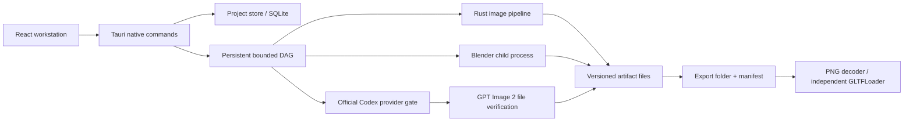

# Architecture

The product is a local desktop workstation for asset bundles. Tauri 2 provides the native shell and command boundary; React/TypeScript is the UI; Rust owns storage, jobs, image processing and child-process lifecycle. There is no application HTTP server, Docker, Redis, cloud database or paid API requirement.

| Boundary | Location | Responsibility |
| --- | --- | --- |
| Desktop composition | `apps/desktop/src-tauri` | Native commands, dialogs, process integration and event delivery |
| Workstation UI | `packages/ui`, `apps/desktop/src` | Library, 2D canvas, Three.js viewport, inspectors and queue |
| Shared contracts | `packages/contracts`, `crates/core/src/models.rs` | Versioned serializable data exchanged by UI/Rust/workers |
| Local persistence | `crates/core` | SQLite migrations, project snapshots, immutable artifacts and exports |
| Job execution | `crates/scheduler` | Dependency DAG, persistent states, bounded resources, fairness and cancellation |
| Subscription provider | `crates/providers` | Official runtime inspection and fail-closed capability gating |
| Deterministic images | `crates/image-pipeline` | Decode, transforms, masks, sprites, packing and validation |
| Procedural models | `workers/blender` | Approved template + validated parameters → real mesh, GLB, editable source and render |
| Independent QA | `tests`, `scripts/verify-artifacts.mjs` | Decode and reopen outputs independently of producing implementation |

`Project`, `Asset`, `AssetVersion`, `AssetSpec`, `StyleGuide`, `Job`, `Artifact`, `ProviderCapability`, `ExportPreset` and `ValidationReport` are data models independent of UI state. JSON fields use camelCase, schema version 1. Artifact paths in export manifests are relative to the bundle root; hashes are SHA-256. Requested and confirmed models are separate nullable values. `fixture`, `import` and `procedural` provenance must never become `codex_subscription` merely because tests pass.

Each local job owns fresh input/output/temp paths. New versions retain originals. Outputs are written through temporary files and atomic finalization. SQLite keeps the authoritative task history; a standalone export does not require the database. Restart recovery must distinguish unfinished local work from an external request with an unknown remote outcome.

Native local cache keys include input SHA-256 and tool versions. Explicit reuse validates the stored result copy before activating it; request batches are serialized to avoid racing project switches. Windows native integration verified reuse and reopen. A local cache does not resend an external request with an unknown outcome. Every claim has a fresh execution UUID; completion journals bind that execution and verified output hashes. A crash between output DB save and journal publication remains an unfinished boundary.

CPU/image, Blender and external-provider concurrency are separate resource classes. Worker process count and Blender thread count both count toward oversubscription decisions. Local cancellation means stopping local work; remote cancellation is only advertised when the provider proves it. Progress exposes observed stages and nullable counts, not invented percentages.

Blender is an explicit optional local dependency. Only the repository's audited Python template runs. Imported/generated asset content is data, never executable code. `--factory-startup --disable-autoexec` and a bounded thread count are mandatory. A child process is not an OS sandbox. `.blend` uses meters/Z-up; GLB uses meters/Y-up and a bottom-center pivot. Procedural assemblies are visualization meshes and may contain overlapping closed components; they are not manufacturing solids.

Subscription feasibility is an independent acceptance gate. The user selected GPT Image 2. Authentication and tool discovery do not prove generation, file receipt or reopen. See [provider feasibility](provider-feasibility.md). The application uses official app-server RPC without calling private HTTP endpoints, extracting cookies or falling back to a paid API.

This first release supports internal modules through explicit interfaces. A plugin marketplace, arbitrary code plugin execution, image-to-3D models, manufacturing CAD and engine-specific importers are future adapters rather than partially working menus.
